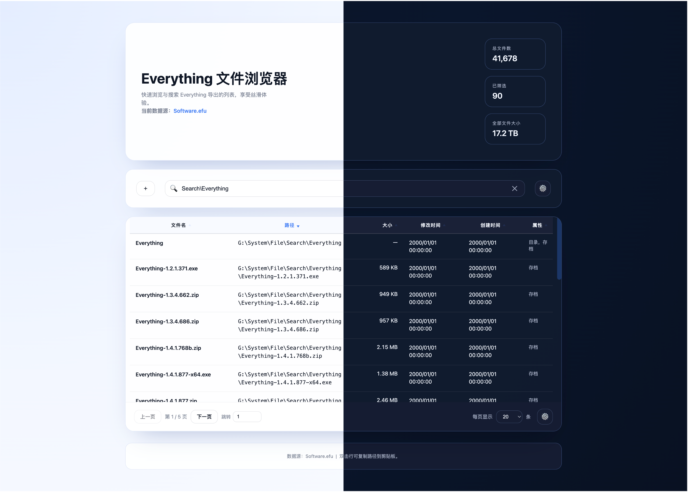

# Everything File Browser (Web)

一个可视化浏览 Everything 导出的 `.efu` 文件列表的静态网页应用，支持快速搜索、筛选、列显示切换和多主题展示。适合在本地网络或容器环境中部署，快速共享文件索引信息。



## 功能特性

- 🗂️ 解析 Everything 导出的 `.efu` 文件并可视化浏览
- 🔍 支持模糊匹配、正则表达式以及大小写敏感切换的搜索
- 🧭 列显示、分页、多主题（明亮 / 暗黑 / macOS 风格）随时切换
- 📊 自动统计筛选后的文件数量与总大小
- 🖱️ 双击一行即可复制文件路径，便于在系统中快速定位
- 📦 提供标准 Docker 镜像与 docker-compose 部署方案

## 快速开始

### 克隆仓库

```bash
git clone https://github.com/raytions/efu-browser.git
cd efu-browser
```

### 本地预览（不使用 Docker）

由于这是纯静态网页，可直接使用任意静态文件服务器，例如 Python 自带的 `http.server`：

```bash
python -m http.server 8080
```

浏览器访问 <http://localhost:8080> 即可查看页面。如果你使用 VS Code 的 Live Server 或其他静态服务器，也能得到同样效果。

## 使用 Docker 运行

### 构建镜像

```bash
docker build -t efu-browser:latest .
```

### 启动容器

```bash
docker run --rm -p 8080:80 efu-browser:latest
```

访问 <http://localhost:8080> 查看应用。启动时会把仓库中的静态文件复制到容器的 Nginx 目录下，并启用简单的缓存策略。

## 使用 docker-compose

仓库内提供了最小化的 `docker-compose.yml`，可以通过以下命令启动：

```bash
docker compose up --build
```

默认映射 `8080:80` 端口，可在 `docker-compose.yml` 中按需修改。

## 项目结构

```text
.
├── Dockerfile
├── docker-compose.yml
├── docker/
│   └── nginx.conf      
├── docs/
│   └── screenshots/
│       └── (overview.png) 
├── index.html
├── app.js
├── styles.css
├── .dockerignore
└── README.md
```

## 开源协议

MIT License。欢迎 Issue / PR，共同完善 Everything 文件浏览体验。

## 项目维护


祝你玩得愉快 🚀
